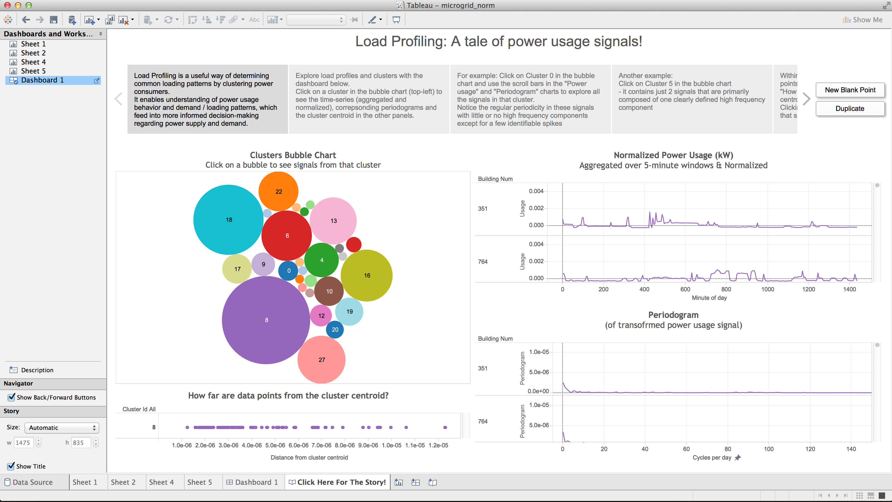

# microgrid-demo

This demo shows how one can do load profiling using smart meter power usage data. Load profiling is about understanding patterns of usage over relevant periods of time (such as day/week etc). Different users will exhibit different usage patterns and clustering them provides an understanding of groups of similar users. This understanding will enable better planning for current and future demand.

This analysis uses the Microgrid [dataset] (http://smart.cs.umass.edu/download.php?t=microgrid) from the [UMASS Trace repository] (http://traces.cs.umass.edu/index.php/Smart/Smart)

The analysis presented in this repo has also been successfully applied to commercial smart meter data and provided useful insights by clustering similar consumers together based on their power usage signals.

## Demo the results locally (results packaged with the dashboard)
###### Pre-requisites:
* Tableau installed on the machine from which you will view the dashboard (e.g. your laptop)
* Make sure the version of Tableau installed can open the file

###### Instructions:
* Download the latest Tableau workbook (with extract) file that has the .twbx extension from the twbx/ directory
* Open the file and go to the "Click Here for The Story!" tab (enable presentation mode if you like)
* Walk through the panels of the story and explore the dashboard as suggested
* Go forth and craft your own exploration!

## Demo the code by running it and explore the results by live-connecting to the database
###### Requires:
* GPDB installation:
    * GPDB sandbox virtual machine available at [https://network.pivotal.io/] (https://network.pivotal.io/)
    * Login credentials to the database
    * MADlib installed (the demo runs the 'k-means' function)
    * PL/R installed (the demo uses the 'pgram' function to generate periodograms)
* Tableau installed on the machine from which you will view the dashboard (e.g. your laptop)
    * Make sure the version of Tableau installed can open the file

###### Instructions:
All relevant code to be run for the demo is located in the src/sql/ directory.
* Code creates its own schema with the name "mgdemo" and can be run in an existing database or a new db
  * NOTE: CODE WILL FIRST DROP ANY EXISTING SCHEMA BY THE NAME "mgdemo"
* Code can be run via psql or pgAdmin
* SQL files are named sequentially and should be run in that order:
  * 01-load-data.sql
  * 02-pre-processing.sql
  * 03-periodogram-gen.sql
  * 04-clustering.sql
    * Clustering is done using the k-means algorithm with k-means++ seeding.
      * Note that there is some randomness in the seeding process. So, the results may not be exactly the same as those in the twbx workbook.
      * The clustering process for this type of data can result in several well-defined clusters that are small or moderately sized and one large catch-all cluster. We re-cluster any large cluster as a further step in the analysis. When re-running this part of the code make sure to re-cluster the correct (largest) one for your run of the problem
  * 05-post-processing.sql
